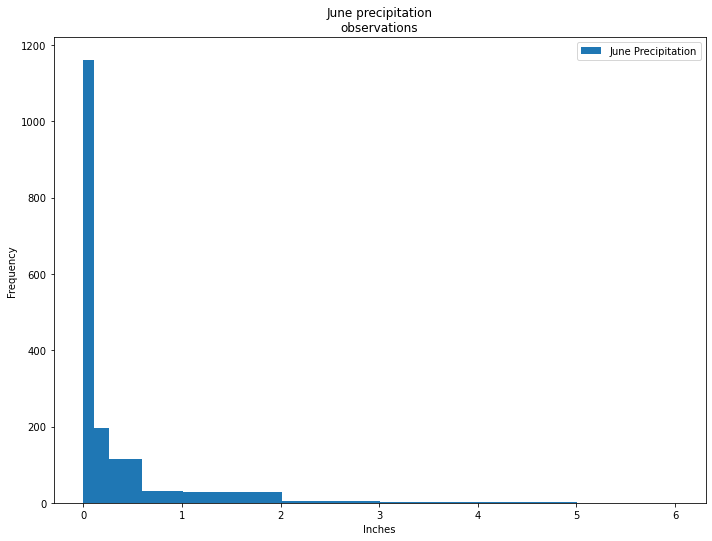
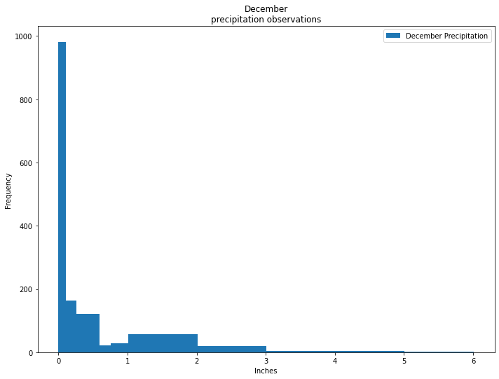
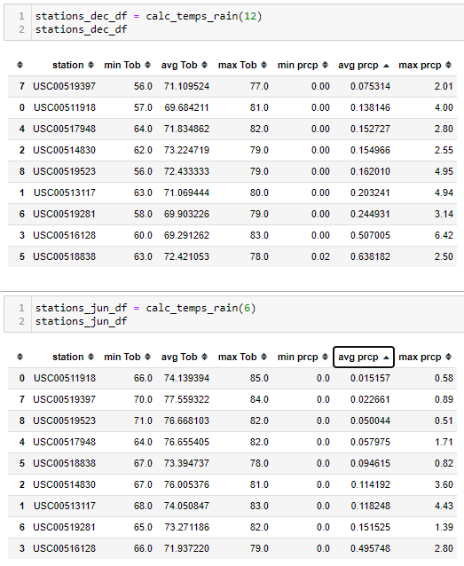

# Surf's Up: Oahu's new Surf n' Shake - Board & Ice Cream Shop 
Advanced Data Storage and Retrieval with SQLAlchemy and Flask


## Overview

The propose of this analysis is to determine the feasibility of year round business plan to open a store that rents/sells surfboards and serves up ice-cream in the island of Oahu 

## Resources

- Data Source:   [hawaii.sqlite](hawaii.sqlite)
- Query and Database creation files: [SurfsUp_Challenge.ipynb](SurfsUp_Challenge.ipynb), [climate_analysis.ipynb](climate_analysis.ipynb), [Flask test program app.py](app.py),
- Results: [temps_june](Resources/temps_june.png), [temps_dec](Resources/temps_dec.png), [precipitation_june](Resources/precipitation_june.png), [precipitation_dec](Resources/precipitation_dec.png), [best_location](Resources/best_location.PNG)
- Software: SQLite, DB Browser for SQLite 3.12.1, Python 3.7.9, Flask 1.1.2, Jupyter notebook.6.1.4

## Results
Calculating for the percentage differences between the summary historical statistics of June and December months using Percentage Difference calculator

```
Percentage Difference=|ΔV|[ΣV2]×100     (in excel written as = ABS(A1-B1)/(A1+B1/2)*100) rounded to .00
```


| Stats | June Temps | December Temps | Percentage Difference  |
| ----- | ---------- | -------------- | ---------------------- |
| count | 1700       | 1517           | 7.44                   |
| mean  | 74.944118  | 71.041529      | 3.53                   |
| std   | 3.257417   | 3.74592        | 9.52                   |
| min   | 64         | 56             | 8.70                   |
| 25%   | 73         | 69             | 3.72                   |
| 50%   | 75         | 71             | 3.62                   |
| 75%   | 77         | 74             | 2.63                   |
| max   | 85         | 83             | 1.58                   |

- The largest differences is the standard deviation (std), reflected in the larger minimum December temperature at 56 degrees Fahrenheit vs 64 degrees Fahrenheit during June.

- The difference in counts between June and December (1700 vs 1517, for a difference of 7.4%).

- Outside of the station recording count being a difference of 7.5 % more during June, all other statistical values are under 5% difference. The mean temperature is imperceptible difference of 71 degrees F during December while 74 degrees F in June. Which is typically a very comfortable temperature to be outdoors in

## Summary

Based on the data analysis above, we have year round temperatures that are on a normal distribution at or above 70 degrees Fahrenheit to the 25th percentile at at the 75th percentiles with a mean difference between between Dec and June of less than 4 degrees colder in the winter month. This would allow for the clientele to surf year round and with temperatures above freezing and typically in the 70-75 degrees probably year round, The ice cream sales would not be severely impacted by colder temperature months. 

An additional query we would want to make is precipitation as a factor, based on the charge from *Weather Insurance Agency* below, a rainfall of 1/10 of an inch would suggest that there would not be puddles on the ground that would not stay for the day.

1.)

| rainfall in inches | Description (per https://weatherins.com/rain-guidelines/)    |
| ------------------ | :----------------------------------------------------------- |
| 1/100 (0.01)       | The first measurable amount of rainfall reported by The National Weather Service. This would not leave puddles on the ground and would slightly wet the surface. This might occur during a light shower for 2-5 minutes or even a drizzle for 2 hours. |
| **1/10 (0.10)**    | **A light rain for 30-45 minutes, moderate rain for 10 minutes or heavy rain for 5 minutes. Small puddles would form but usually disappear after a short while.** |
| 1/4 (0.25)         | A light rain for 2-3 hours, moderate rain for 30-60 minutes or heavy rain for 15 minutes. There would be many puddles on the ground and they would not disappear easily. |
| 1/2 (0.5)          | A light rain never reaches this amount, moderate rain for 1-2 hours or heavy rain for 30-45 minutes. There would be deep standing water and they would last for long periods of time. |
| 3/4 (0.75)         | A light moderate rain never reaches this amount, heavy rain lasting for 2-4 hours. There would be deep standing water for long periods of time. |
| One (1.00)         | A light moderate rain never reaches this amount, heavy rain for several hours (2-5 hours). There would be deep standing water for long periods of time. |

First we consider the probability of dry days (clear visibility days) based on the days of rainfall with 0.10 as the deciding value weather the day is mostly clear or rain and possibly low visibility.



The chart displays 1162 readings where the rain is 1/10th of an inch or less (clear day) and 412 days where precipitation could create puddles



Although December is not as dry as June is, it is comparably still favorable with the chart displaying 982 readings where the rain is 1/10th of an inch or less (clear day) and 455 (just 43 less days recorded where precipitation could create puddles)


2.) Another additional query that could be made is to determine which reading station is the dryest and/or has the highest temperatures which would be favorable for our Ice Cream Sales to develop a heat map

writing this function, we can gather average temperature and precipitations by locations

```
def calc_temps_rain(val_month):
        sel = [Measurement.station, func.min(Measurement.tobs), func.avg(Measurement.tobs),\
                        func.max(Measurement.tobs),func.min(Measurement.prcp), \
                        func.avg(Measurement.prcp), func.max(Measurement.prcp)]
        results = session.query(*sel).group_by(Measurement.station).\
                        filter(extract('month', Measurement.date)==val_month).all()
        stations_df = pd.DataFrame(results, columns = ['station', 'minTob' , 'avgTob', \
                                                'maxTob','minprcp' , 'avgprcp', 'maxprcp']) 
        return stations_df
```

We can extract a summary of values that can help us determine which location can give use the least amount of rainfall and desirable temperatures to plot a location for the store where typically we would prefer a combination that would give us a higher Avg Tob temperature while having the lowest average prcp Precipitation.




